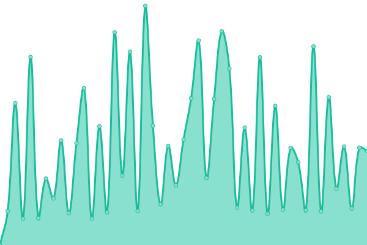

# [📈 Live Status](https://yeshijian.github.io/tmx-uptime): <!--live status--> **🟩 All systems operational**

This repository contains the open-source uptime monitor and status page for [Casper](https://yeshijian.github.io/tmx-uptime), powered by [Upptime](https://github.com/upptime/upptime).

With [Upptime](https://upptime.js.org), you can get your own unlimited and free uptime monitor and status page, powered entirely by a GitHub repository. We use [Issues](https://github.com/yeshijian/tmx-uptime/issues) as incident reports, [Actions](https://github.com/yeshijian/tmx-uptime/actions) as uptime monitors, and [Pages](https://yeshijian.github.io/tmx-uptime) for the status page.

<!--start: status pages-->
<!-- This summary is generated by Upptime (https://github.com/upptime/upptime) -->
<!-- Do not edit this manually, your changes will be overwritten -->
<!-- prettier-ignore -->
| URL | Status | History | Response Time | Uptime |
| --- | ------ | ------- | ------------- | ------ |
|  [tmx-cm](https://www.teammax.cc) | 🟩 Up | [tmx-cm.yml](https://github.com/iapsekian/tmx-uptime/commits/HEAD/history/tmx-cm.yml) | 

 2139ms
     
 | 

<a href="https://yeshijian.github.io/tmx-uptime/history/tmx-cm">84.97%</a>
    

|  [tmx-crm](https://crm.teammax.cc) | 🟩 Up | [tmx-crm.yml](https://github.com/iapsekian/tmx-uptime/commits/HEAD/history/tmx-crm.yml) | 

 401ms
     
 | 

<a href="https://yeshijian.github.io/tmx-uptime/history/tmx-crm">95.62%</a>
    

<!--end: status pages-->

[**Visit our status website →**](https://yeshijian.github.io/tmx-uptime)

## 📄 License

- Powered by: [Upptime](https://github.com/upptime/upptime)
- Code: [MIT](./LICENSE) © [Casper](https://yeshijian.github.io/tmx-uptime)
- Data in the `./history` directory: [Open Database License](https://opendatacommons.org/licenses/odbl/1-0/)
